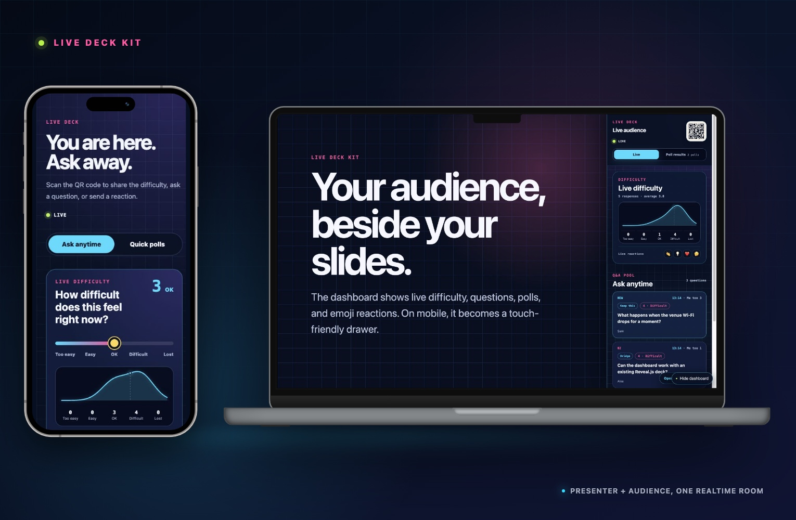

# Live Deck Kit

[Start a hosted event](https://live-deck-kit.mashbean.workers.dev/new/)

Add realtime difficulty feedback, audience questions, emoji reactions, quick polls, and a QR entry point to any web slide deck. A speaker can connect an existing browser-based deck without deploying infrastructure or editing code.

Audience members join from their phones. The presenter sees a live dashboard beside the deck and can collapse it at any time. Desktop layouts can use a 75/25 split, while phones and tablets get a touch-friendly drawer.



## Start a hosted event

Open [`/new/`](https://live-deck-kit.mashbean.workers.dev/new/), paste the title and browser-playable deck URL, and choose **Create event**. The service immediately returns

- a presenter view with the deck and dashboard together
- an audience URL and QR code
- a private setup link for the speaker
- a separate private moderation link for an assistant

There is no account, cloud deployment, or token selection in the speaker flow. Access credentials are generated automatically and carried in URL fragments, which are not sent in HTTP requests. The public beta limits new-event creation globally and deletes hosted event data after seven days. Do not use the beta for sensitive or confidential material.

Some presentation hosts block iframe embedding. The presenter toolbar therefore keeps an **Open deck separately** fallback. Google Slides sharing URLs are converted to embed URLs automatically.

## Start with one prompt

Install the bundled Codex skill, then use a prompt like this

> Add Live Deck Kit to this web slide deck. The event is called “My Event.” Preserve the existing slides and animations, deploy the realtime service to my Cloudflare account, use a right-side 25% dashboard on desktop, and use a drawer on mobile.

The skill configures the event, deploys the realtime service, embeds the dashboard, tests desktop and mobile behavior, and hands back the audience and presenter URLs.

## Features

- Realtime 1–5 difficulty feedback with a distribution curve
- Newest-first audience questions, question lenses, difficulty-at-submission, and “I have this question too” upvotes
- Four configurable emoji reactions with presenter-side popup animations
- Up to eight quick polls with vote counts
- An always-available dashboard QR code that points to the audience page
- A hosted `/new/` flow that creates an isolated event and private capability links in one form submission
- A no-code `/setup/` wizard that stores event configuration in the event's Durable Object
- A standalone `/present/` view that combines an existing web deck and the live dashboard
- Hibernation WebSockets so the Durable Object can sleep while idle
- A configurable per-device question limit, defaulting to 20
- A code-of-conduct gate with a fixed event alias and stable participant badge
- An eight-second presentation buffer, author-only holds, slow mode, approval mode, pause, and event close controls
- A mobile-first moderator console with hide, restore, review, and mute actions
- Token-protected export and reset endpoints
- A privacy-preserving Uncommon Ground post-event export
- An idempotent HTML integration CLI
- Overlay mode and a desktop 75/25 split mode

## Architecture

```text
Existing web deck ── iframe ── hosted /present/ ── presenter dashboard
       or                                           │
Web slide deck ── live-deck-panel ──────────────────┤
                                                   │
Audience phones ── audience page ──────────────────┤
                                                   ▼
                                      Cloudflare Worker API
                                                   │
                                  one Durable Object per event
                                                   │
                                      Hibernation WebSockets
```

Hosted events share the Worker code but receive separate Durable Objects, SQLite state, random event identifiers, and access hashes. The service does not store raw IP addresses. Self-hosted deployments can still use the original single-event root routes.

## Self-host

[](https://deploy.workers.cloudflare.com/?url=https://github.com/mashbean/live-deck-kit)

Self-hosting is optional. The deploy button copies the repository, provisions the Durable Object, and deploys the Worker. After deployment, open `/new/`; event access links are generated automatically. Use the terminal path below only for a source-configured permanent event or deeper HTML integration.

## Self-host from a terminal

Requirements are Node.js 22 or later and a Cloudflare account.

```bash
gh repo clone mashbean/live-deck-kit
cd live-deck-kit
npm install
npm run types
```

Edit [`public/event.config.json`](./public/event.config.json), then create separate admin and moderator tokens and check the project.

```bash
npm run admin-token
npm run moderator-token
npm run check
npx wrangler login
npm run deploy
```

The token commands write SHA-256 hashes to `wrangler.jsonc`. Plaintext tokens are stored only in the Git-ignored `.live-deck-admin-token` and `.live-deck-moderator-token` files. Give assistants only the moderator token. It cannot export or reset event data.

After Wrangler returns the HTTPS service URL, add the dashboard to an existing deck.

```bash
npm run integrate -- \
  --deck /absolute/path/to/deck/index.html \
  --service-url https://YOUR-WORKER.workers.dev \
  --mode split \
  --target-selector '.deck-stage' \
  --desktop-width '25vw'
```

Use `--mode overlay` when the deck's main presentation container is unknown. The CLI only manages the block between `live-deck-kit:start` and `live-deck-kit:end`, so rerunning it updates the existing integration instead of inserting a duplicate.

## Manual embed

```html
<script type="module" src="https://YOUR-WORKER.workers.dev/embed/live-deck-panel.js"></script>
<live-deck-panel
  service-url="https://YOUR-WORKER.workers.dev"
  mode="split"
  target-selector=".deck-stage"
  desktop-width="25vw"
></live-deck-panel>
```

## Install the Codex skill

Install directly from GitHub

```bash
npx --yes github:mashbean/live-deck-kit install-skill
```

Or install from a local clone

```bash
npm run install-skill
```

The skill is installed to `$CODEX_HOME/skills/live-deck-kit`. When `CODEX_HOME` is unset, it uses `~/.codex/skills/live-deck-kit`.

## Event configuration

For hosted events, the private setup link returned by `/new/` is the primary way to change public copy, colors, difficulty labels, reactions, and polls. Its access secret is consumed from the URL fragment and retained only for that browser tab. [`public/event.config.json`](./public/event.config.json) remains the version-controlled default and fallback for source-configured self-hosted events. The complete field reference is in [`skills/live-deck-kit/references/configuration.md`](./skills/live-deck-kit/references/configuration.md).

`eventId` participates in the Durable Object name. Keep it stable after a production event begins collecting data unless you intentionally want a new, empty event.

## Admin API

Load `.live-deck-admin-token` into a temporary shell variable, then unset it when finished.

```bash
LIVE_DECK_ADMIN_TOKEN="$(tr -d '\n' < .live-deck-admin-token)"

curl -H "Authorization: Bearer $LIVE_DECK_ADMIN_TOKEN" \
  https://YOUR-WORKER.workers.dev/api/admin/export

curl -X POST -H "Authorization: Bearer $LIVE_DECK_ADMIN_TOKEN" \
  https://YOUR-WORKER.workers.dev/api/admin/reset

unset LIVE_DECK_ADMIN_TOKEN
```

Resetting state cannot be undone by the service. Export first and verify the exact event URL before resetting anything.

The setup wizard uses the same admin token with `GET` and `POST /api/admin/config`. The browser keeps the token in `sessionStorage`, not persistent local storage. Configuration updates do not reset responses, and `eventId` cannot be changed through the wizard.

## Live moderation

When moderation is enabled in `public/event.config.json`, a participant accepts the event code of conduct and chooses one event alias before asking a question. The server keeps that alias fixed and adds a short event-local badge. Questions enter a configurable presentation buffer before becoming public.

Participants can report a public question for harassment, deliberate disruption, serious off-topic content, or private information. There is no general dislike reason. One event identity can report a question once and cannot report its own question. The adaptive threshold requires several independent identities before the question is temporarily removed from public view. Report counts and reasons remain moderator-only.

Open the mobile-first console at `https://YOUR-WORKER.workers.dev/moderate/` and enter the separate moderator token. Moderators can confirm or reverse a community hold, hide or restore one question, slow a participant, require review for future questions, mute free-text questions, or restore access. The presenter dashboard and public API only receive public questions. A held question remains visible on its author's device with a truthful `Not public` status.

Confirmed reports increase the reporter's future trust weight. Restored questions reduce the weight of reporters whose flags were rejected. Crowd reports never mute a participant automatically, and moderator judgment always wins.

Session controls provide five modes

- `open` publishes questions after the configured buffer
- `slow` applies the longer event cooldown
- `approval` holds every new question for moderator review
- `paused` temporarily stops new questions while polls, reactions, and difficulty remain available
- `closed` ends free-text questions for the event

All moderation actions, original question rows, report reasons, resolution outcomes, and event-local reporter IDs remain available to the admin export. The default schema does not store IP addresses or legal names.

## Close the loop with Uncommon Ground

Live Deck Kit can convert its post-event JSON export into the `questions.json` contract used by
[`audreyt/uncommon-ground`](https://github.com/audreyt/uncommon-ground). Source question IDs and
browser voter IDs are replaced with event-local sequential codes. Display names are removed unless
you explicitly pass `--keep-names`. Moderated rows remain in the private working file as
`Withdrawn`, while Uncommon Ground excludes them from the published page.

```bash
npm run uncommon-ground -- \
  --questions /path/to/questions.json \
  --question-votes /path/to/question-votes.json \
  --classifications /path/to/moderation-review.json \
  --event my-event \
  --out /private/workdir/questions.json
```

The default withdrawn labels are `negative` and `provocative`. Override them only after a human
moderation review.

Then run the upstream pipeline from its own checkout. Do not nest that repository inside a deck
or Live Deck Kit checkout.

```bash
gh repo clone audreyt/uncommon-ground
cd uncommon-ground
python3 assemble.py /private/workdir templates/uncommon-ground.html /private/workdir/uncommon-ground.html
node domcheck.js /private/workdir/uncommon-ground.html
python3 verify.py /private/workdir --expected=N
```

## Testing

```bash
npm run doctor
npm run typecheck
npm test
npm run deploy:dry
```

Tests use Cloudflare's official Vitest Workers integration and exercise a real Durable Object binding inside the Workers runtime. The default suite creates only a few participants and does not include a load test.

## Inspirations and dependencies

- Realtime interaction and Durable Objects routing were informed by [`htlin222/kahoot-cf`](https://github.com/htlin222/kahoot-cf), licensed under MIT
- The four question lenses and the post-event export contract interoperate with [`audreyt/uncommon-ground`](https://github.com/audreyt/uncommon-ground), licensed under CC0-1.0. The clustering and loopback pipeline remains in its upstream repository
- Realtime state uses Cloudflare Workers, Durable Objects, SQLite, and Hibernation WebSockets
- QR code generation uses [`soldair/node-qrcode`](https://github.com/soldair/node-qrcode)
- The repository device mockup uses [`picturepan2/devices.css`](https://github.com/picturepan2/devices.css), licensed under MIT

Live Deck Kit is a separate implementation designed for live feedback beside a web presentation. It does not include the quiz editor, authentication, scoring, or game lifecycle from `kahoot-cf`.

## License

[Apache License 2.0](./LICENSE). Modification, distribution, and commercial use are permitted, with an explicit patent grant. See [`NOTICE`](./NOTICE) and [`THIRD_PARTY_NOTICES.md`](./THIRD_PARTY_NOTICES.md) for attribution details.
